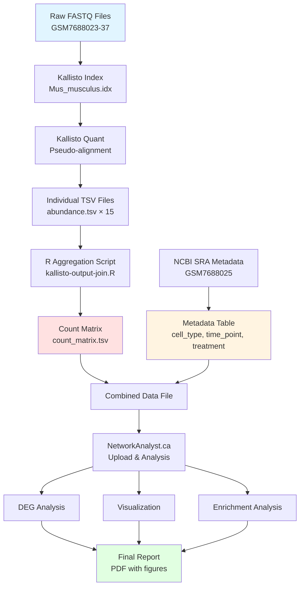

# RNA-seq Analysis with Kallisto and NetworkAnalyst.ca

## Project Overview

This project implements a complete RNA-seq data analysis pipeline using Kallisto for transcript quantification and NetworkAnalyst.ca for downstream differential expression analysis and functional enrichment. The analysis focuses on mouse (*Mus musculus*) CD4/CD8 T cell populations comparing transfer vs control conditions at different time points.

---

## Table of Contents

- [Project Architecture](#project-architecture)
- [Workflow Diagram](#workflow-diagram)
- [Technologies Used](#technologies-used)
- [Dataset Information](#dataset-information)
- [Installation & Setup](#installation--setup)
- [Pipeline Steps](#pipeline-steps)
- [Technical Challenges & Solutions](#technical-challenges--solutions)
- [Results](#results)
- [Directory Structure](#directory-structure)
- [References](#references)

---

## Project Architecture

```
┌─────────────────────────────────────────────────────────────┐
│                    RNA-seq Analysis Pipeline                 │
└─────────────────────────────────────────────────────────────┘
                              │
                              ▼
┌─────────────────────────────────────────────────────────────┐
│  PHASE 1: Data Preparation & Environment Setup              │
│  - HPC cluster (Northeastern Explorer)                      │
│  - SLURM job scheduling                                      │
│  - Apptainer container (Kallisto v0.51.0)                   │
└─────────────────────────────────────────────────────────────┘
                              │
                              ▼
┌─────────────────────────────────────────────────────────────┐
│  PHASE 2: Reference Transcriptome Indexing                  │
│  Input: Mus_musculus.GRCm39.cdna.all.fa.gz (Ensembl)       │
│  Output: Mus_musculus.idx (Kallisto index)                  │
└─────────────────────────────────────────────────────────────┘
                              │
                              ▼
┌─────────────────────────────────────────────────────────────┐
│  PHASE 3: Transcript Quantification                         │
│  Tool: Kallisto quant (pseudo-alignment)                    │
│  - Single-end reads                                          │
│  - Fragment length: 200 ± 20 bp                             │
│  - 15 samples processed                                      │
└─────────────────────────────────────────────────────────────┘
                              │
                              ▼
┌─────────────────────────────────────────────────────────────┐
│  PHASE 4: Data Aggregation                                  │
│  Tool: R (readr, dplyr)                                     │
│  - Merge abundance.tsv files                                 │
│  - Create unified count matrix                               │
└─────────────────────────────────────────────────────────────┘
                              │
                              ▼
┌─────────────────────────────────────────────────────────────┐
│  PHASE 5: Metadata Integration                              │
│  Source: NCBI SRA (BioProject PRJNA1002789)                 │
│  - Cell type classification                                  │
│  - Time point annotation                                     │
│  - Treatment condition mapping                               │
└─────────────────────────────────────────────────────────────┘
                              │
                              ▼
┌─────────────────────────────────────────────────────────────┐
│  PHASE 6: Differential Expression & Enrichment Analysis     │
│  Platform: NetworkAnalyst.ca (ExpressAnalyst)               │
│  - DEG identification                                        │
│  - Gene ontology enrichment                                  │
│  - Pathway analysis                                          │
│  - Network visualization                                     │
└─────────────────────────────────────────────────────────────┘
```

---

## Workflow Diagram



---

## Technologies Used

| Component | Technology | Version | Purpose |
|-----------|-----------|---------|---------|
| **HPC Cluster** | Northeastern Explorer | - | Computational resources |
| **Job Scheduler** | SLURM | - | Resource management |
| **Container** | Apptainer (Singularity) | - | Software environment |
| **Quantification** | Kallisto | 0.51.0 | Transcript abundance estimation |
| **Data Processing** | R | 4.x | Data aggregation |
| **R Packages** | readr, dplyr | Latest | File I/O and data manipulation |
| **Environment** | renv | Latest | R dependency management |
| **Analysis Platform** | NetworkAnalyst.ca | Web | DEG & enrichment analysis |
| **Reference** | Ensembl GRCm39 | Release 113 | Mouse transcriptome |

---

## Dataset Information

**Study**: RNA-seq of lymphocyte populations in Graft vs Host Disease (mouse model)

- **BioProject**: PRJNA1002789
- **SRA Study**: SRX21270475
- **Organism**: *Mus musculus* (house mouse)
- **Library**: ILLUMINA HiSeq 2500
- **Strategy**: RNA-Seq (Transcriptomic)
- **Selection**: cDNA
- **Layout**: PAIRED (27.9M spots, 8.4G bases per run)

### Experimental Design

| Factor | Levels | Description |
|--------|--------|-------------|
| **Cell Type** | CD4, CD8 | T cell populations |
| **Time Point** | Day 0, Day 7 | Temporal progression |
| **Treatment** | None, Transfer | Allogeneic transfer vs control |

**Total Samples**: 15 biological replicates

---

## Installation & Setup

### Prerequisites

- Access to HPC cluster with SLURM
- SSH client
- R (version 4.0+)
- Internet connection for data download

### Environment Setup

```bash
# 1. Log into HPC
ssh <USER.NAME>@login.explorer.northeastern.edu

# 2. Start interactive job
srun --partition=courses --export=ALL --mem=8G -t 04:00:00 --pty bash

# 3. Set up directory structure
COURSE_DIR=$(readlink -f /courses/BINF6310.<CRN>)
DATA_DIR="${COURSE_DIR}/data/RNA-Seq"
cd /scratch/${USER}
mkdir -p module10 && cd module10

# 4. Copy analysis scripts
cp ${DATA_DIR}/Kallisto-bash.sh .
cp ${DATA_DIR}/Kallisto-output-join.R .

# 5. Create Kallisto alias
alias kallisto="apptainer run -B '/courses:/courses,/scratch:/scratch,/home:/home' \
  ${COURSE_DIR}/shared_data/kallisto_0.51.0.sif"
```

---

## Pipeline Steps

### Step 1: Download Reference Transcriptome

```bash
# Option A: Direct download from Ensembl
wget http://ftp.ensembl.org/pub/release-113/fasta/mus_musculus/cdna/Mus_musculus.GRCm39.cdna.all.fa.gz

# Option B: Use existing course file
TRANSCRIPTOME="${DATA_DIR}/Mus_musculus.GRCm39.cdna.all.fa.gz"
```

### Step 2: Build Kallisto Index

```bash
kallisto index -i Mus_musculus.idx ${TRANSCRIPTOME}
```

**Output**: `Mus_musculus.idx` (~3.5 GB)

### Step 3: Edit Quantification Script

```bash
nano Kallisto-bash.sh
```

Change `DIRECTORY` variable to use full path:

```bash
DIRECTORY="${DATA_DIR}/rnaseq-mus-musculus-GSE240196"
```

### Step 4: Run Kallisto Quantification

```bash
mkdir kallisto-output
bash Kallisto-bash.sh
```

**Expected Runtime**: 30-60 minutes

**Output**: 15 subdirectories in `kallisto-output/`, each containing:
- `abundance.tsv` (renamed to match sample ID)
- `abundance.h5`
- `run_info.json`

### Step 5: Aggregate Results in R

```bash
# Load R module
module load R
R

# Install dependencies
install.packages('renv', repos="https://cloud.r-project.org")
renv::init()
# Restart R
renv::install(c('readr', 'dplyr'), prompt=FALSE, lock=TRUE)
q()

# Run aggregation script
Rscript Kallisto-output-join.R
```

**Output**: `kallisto-output/count_matrix.tsv`

### Step 6: Download Results

```bash
# Get file path
readlink -f kallisto-output/count_matrix.tsv

# Exit Explorer (Ctrl+D twice)
# On local machine:
scp <USER.NAME>@xfer.discovery.neu.edu:<PATH_TO_FILE> .
```

### Step 7: Prepare Metadata

1. Visit [NCBI SRA](https://www.ncbi.nlm.nih.gov/sra) → Search "GSM7688025"
2. Navigate to BioProject → Download metadata from Run Selector
3. Create spreadsheet with columns:
   - `Sample_Name`
   - `cell_type` (CD4/CD8)
   - `time_point` (Day 0/Day 7)
   - `treatment` (None/Transfer)
4. Transpose table
5. Prefix rows with `#CLASS:` (e.g., `#CLASS:cell_type`)
6. Merge with `count_matrix.tsv`

### Step 8: Analyze with NetworkAnalyst.ca

1. Visit [NetworkAnalyst.ca](https://www.networkanalyst.ca)
2. Select **Gene Expression Table** → **Single Expression Table**
3. Upload modified `count_matrix.tsv`
4. Configure:
   - Organism: Mouse
   - Data type: RNA-seq counts
   - ID type: Ensembl Gene ID
5. Perform analyses:
   - Differential expression
   - PCA / clustering
   - Gene ontology enrichment
   - KEGG pathway analysis

---

## Technical Challenges & Solutions

### Challenge 1: File Path Resolution Error

**Problem**: 
```
Error: file not found /GSM*
```

**Root Cause**: The `DIRECTORY` variable in `Kallisto-bash.sh` was not properly expanded, causing the script to look for files in the root directory instead of the data directory.

**Solution**:
```bash
# Original (incorrect)
DIRECTORY="rnaseq-mus-musculus-GSE240196"

# Fixed version
DIRECTORY="${DATA_DIR}/rnaseq-mus-musculus-GSE240196"
```

**Key Learning**: Always verify environment variables are set before running scripts that depend on them.

---

### Challenge 2: Container Path Binding

**Problem**: Kallisto containerized environment couldn't access files outside mounted paths.

**Solution**: Properly bind all required directories in the Apptainer alias:
```bash
alias kallisto="apptainer run -B '/courses:/courses,/scratch:/scratch,/home:/home' \
  ${COURSE_DIR}/shared_data/kallisto_0.51.0.sif"
```

**Key Learning**: Container bind mounts must include all directories where input/output files reside.

---

### Challenge 3: R Package Management

**Problem**: Installing packages globally could conflict with other users or projects.

**Solution**: Use `renv` for project-specific package management:
```r
renv::init()  # Create isolated environment
renv::install(c('readr', 'dplyr'), prompt=FALSE, lock=TRUE)
```

**Key Learning**: Virtual environments prevent dependency conflicts and ensure reproducibility.

---

### Challenge 4: Metadata Integration Complexity

**Problem**: Manual metadata extraction from SRA and formatting for NetworkAnalyst was error-prone.

**Solution**: 
1. Download complete metadata from Run Selector
2. Use spreadsheet formulas to clean and reformat
3. Validate column names match exactly with sample IDs
4. Double-check transposition maintains data integrity

**Key Learning**: Automate metadata processing where possible; always validate joins between count data and metadata.

---

### Challenge 5: Kallisto Output Interpretation

**Problem**: Understanding what the intermediate files represent and which to use for downstream analysis.

**File Descriptions**:
- `abundance.tsv`: Human-readable counts (USE THIS)
- `abundance.h5`: Binary format for sleuth
- `run_info.json`: Processing statistics

**Solution**: Focus on `abundance.tsv` files containing columns:
- `target_id`: Transcript/gene ID
- `length`: Effective length
- `eff_length`: Effective length after bias correction
- `est_counts`: Estimated counts
- `tpm`: Transcripts per million

---

## Results

### Quantification Metrics

Sample processing statistics (example from GSM7688023):

```
- Total reads processed: 25,281,460
- Reads pseudo-aligned: 20,872,832 (82.6%)
- Fragment length: mean = 200, sd = 20
- K-mer length: 31
- Target transcripts: 115,911
- EM iterations: 1,179 rounds
```

### Expected Outputs

1. **Count Matrix**: ~115,911 transcripts × 15 samples
2. **Metadata Table**: 15 samples × 4 experimental factors
3. **DEG List**: Differentially expressed genes (FDR < 0.05)
4. **Enrichment Results**: GO terms and KEGG pathways
5. **Visualizations**: 
   - PCA plots
   - Heatmaps
   - Volcano plots
   - Network diagrams

---

## Directory Structure

```
module10/
├── Kallisto-bash.sh              # Quantification script
├── Kallisto-output-join.R         # Aggregation script
├── Mus_musculus.idx               # Kallisto index (3.5 GB)
├── Mus_musculus.GRCm39.cdna.all.fa.gz  # Reference transcriptome
├── kallisto-output/               # Results directory
│   ├── GSM7688023/
│   │   ├── GSM7688023.tsv        # Abundance file
│   │   ├── GSM7688023.h5
│   │   └── run_info.json
│   ├── GSM7688024/
│   ├── ... (13 more samples)
│   └── count_matrix.tsv          # FINAL OUTPUT
├── metadata/
│   └── experimental_design.tsv    # Prepared metadata
└── renv/                          # R environment
    ├── library/
    └── renv.lock
```

---

## Quality Control Checks

- [ ] All 15 samples processed successfully
- [ ] Mapping rates > 70% for all samples
- [ ] Count matrix dimensions correct (115,911 × 15)
- [ ] No missing values in count matrix
- [ ] Metadata matches sample order exactly
- [ ] Sample IDs consistent across files
- [ ] File sizes reasonable (~50-100 MB for count matrix)

---

## References

### Tools & Software

1. **Kallisto**: Bray, N. L., et al. (2016). "Near-optimal probabilistic RNA-seq quantification." *Nature Biotechnology*, 34(5), 525-527.
2. **NetworkAnalyst**: Zhou, G., et al. (2019). "NetworkAnalyst 3.0: a visual analytics platform for comprehensive gene expression profiling and meta-analysis." *Nucleic Acids Research*, 47(W1), W234-W241.

### Data Sources

- **Ensembl**: [https://www.ensembl.org](https://www.ensembl.org)
- **NCBI SRA**: [https://www.ncbi.nlm.nih.gov/sra](https://www.ncbi.nlm.nih.gov/sra)
- **BioProject PRJNA1002789**: Mouse GvHD T cell study

### Documentation

- Kallisto Manual: [https://pachterlab.github.io/kallisto/](https://pachterlab.github.io/kallisto/)
- NetworkAnalyst Tutorials: [https://www.networkanalyst.ca/](https://www.networkanalyst.ca/)

---

## Author

**Md Tariqul Islam**  
Bioinformatics Graduate Student  
Northeastern University

---

## License

This project is for educational purposes as part of BINF6310 coursework.

---

## Acknowledgments

- Northeastern University Research Computing team
- BINF6310 course instructors
- Pachter Lab (Kallisto development)
- Xia Lab (NetworkAnalyst platform)

---

## Future Improvements

- [ ] Automate metadata extraction with Python script
- [ ] Implement DESeq2 analysis locally
- [ ] Add quality control plots (FastQC integration)
- [ ] Create reproducible Snakemake workflow
- [ ] Dockerize entire pipeline for portability
- [ ] Add unit tests for R aggregation script
- [ ] Generate automated QC report with MultiQC

---

*Last Updated: November 2025*
